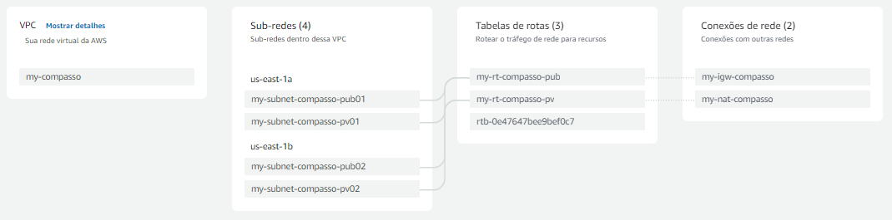

# PRÁTICA DOCKER

A atividade consiste em:
* instalação e configuração do DOCKER ou CONTAINERD no host EC2; Ponto adicional para o trabalho utilizar a instalação via script de Start Instance (user_data.sh) 
* Efetuar Deploy de uma aplicação Wordpress com: container de aplicação RDS database Mysql 
* Configuração da utilização do serviço EFS AWS para estáticos do container de aplicação Wordpress 
* Configuração do serviço de Load Balancer AWS para a aplicação Wordpress


# AWS Configurações

Configurações da Infraestrutura

## VPC (Virtual Private Cloud)

A VPC esta dividida entre duas tabelas de rotas, em que uma é para as subnets privadas e a outra para as subnets públicas, temos duas subnets privadas e públicas, a criação das subnets privadas são para os containers docker com o wordpress, para que seja disponibilizado em um endereço ip privado. As subnets públicas são para permitir que o load balancer consiga conectar-se a internet a partir das duas AZs distintas que elas estão localizadas, para aumentar a disponibilidade, a rout table pública possuí um internet gateway para acessar a internet e a rout table privada possuí um NAT gateway para permitir o tráfego apenas de saída das subnets públicas.



## Security Group (Gurpos de Seguraça)

Para essa atividade foram criados dois grupos de segurança:

Security Group para EC2, EFS, Load Balancer:

|Tipo|Protocolo|Porta|Origem|
|----------|-----|-----|----|
|SSH|TCP|22|0.0.0.0/0|
|HTTP|TCP|80|0.0.0.0/0|
|HTTPS|TCP|443|0.0.0.0/0|
|NFS|TCP|2049|0.0.0.0/0|

Security Group para RDS:

|Tipo|Protocolo|Porta|Origem|
|----------|-----|-----|----|
|MYSQL/Aurora|TCP|3306|SG_EC2|
|MYSQL/Aurora|TCP|3306|MEU_IP|

## Autoscaling

Para a configuração do autoscaling, foi criado o launcher template que utiliza o user_data.sh.

A configuração do autoscaling segue essas etapas:
 * Ir para a seção de "Grupos do Auto Scaling e "criar grupo do Auto Scaling";
 * Selecionar o launcher template criado;
 * Escolher a VPC;
 * Selecionar as subnets privadas;
 * Em balanceador de carga, pode-se selecionar o já criado, ou criar posteriormente;
 * Selecionar a capacidade desejada, mínima e máxima como 2(que foi requerido na atividade);
  
### Launcher Templete

Para o modelo de execução, foi escolhida uma máquina igual a atividade anterior:
 * Amzon Linux 2;
 * t3 small;
 * 16 Gb de volume;
 * Tags de criação;
 * User_data.sh 

## Load Balancer

A criação do load balancer, segue as seguintes etapas: 
 * Ir para a seção de load balancers na AWS, criar lod balancer;
 * Tipo de "Application Load Balancer";
 * Esquema de "Internet-Facing", tipo de IP como "IPv4";
 * Mapear as subnets públicas de cada AZ;
 * Associar um grupo de segurança com o LoadBalancer;
 * Nos listerners e roteamento, selecionar o target group criado;

### TARGET GROUP

Para configurar o target group, devesse seguir as seguintes etapas: 
 * Ir para a seção de grupos de destino na AWS, criar grupo de destino;
 * Na configuração básica selecionar instâncias;
 * Selecionar o protocolo e a porta "HTTP" e "80" "respectivamente, tipo de endereçamento IP será o "IPv4";
 * Associar a VPC que estarão as instâncias EC2;
 * Escolher o caminho para verificação de integridade que serão  "/" e "HTTP";
 * Depois basta registrar as instâncias;

## RDS

O RDS foi configurado seguindo as etapas:
 * Ir para a seção e RDS e Criar banco de dados;
 * Selecionar Método de criação padrão juntamente com MySQL;
 * Selecionar o free tier;
 * Inserir o nome de indentificador da instância;
 * Configurar nome e senha do usuário;
 * Configuração de instância foi "db.t3.micro";
 * Armazenamento gp2;
 * Conectividade opção "não se conectar a um recurso de computação do EC2";
 * IPv4;
 * Selecionar a VPC da atividade;
 * Criar security group para o RDS;
 * Zona de disponibilidade como "Sem preferência";
 * Atuoridade de certificação como padrão;
 * Autenticação com senha;
 * Ir em configurações adicionais e colocar o nome do RDS(não confudir com identificador da instância);


## EFS

Para criar o Elastic File System, basta:

 - Ir para a seção e EFS na AWS;
 - Clicar em "Criar sistema de arquivos";
 - Digitar o nome para o EFS ;
 - Selecionar  VPC que ele ficará;

# SCRIPT E ARQUIVO DE IMAGEM .YAML

 Foi criado um arquivo .yaml no meu github pessoal e depois chamo esse arquivo no user_data.sh que ficará no laucher templete de cada uma das máquinas que será iniciada no autoscaling group.

```yaml
version: '3.7'
services:
  wordpress:
    image: wordpress
    ports:
      - "80:80"
    environment:
      WORDPRESS_DB_HOST: ENDPOIT_RDS
      WORDPRESS_DB_USER: USER_RDS
      WORDPRESS_DB_PASSWORD: SENHA_RDS
      WORDPRESS_DB_NAME: NAME_RDS
    volumes:
      - /mnt/efs/wordpress:/var/www/html
```

user_data.sh:

```sh
#!/bin/bash
yum update -y
yum install docker -y
systemctl start docker
systemctl enable docker
curl -L "https://github.com/docker/compose/releases/latest/download/docker-compose-$(uname -s)-$(uname -m)" -o /usr/local/bin/docker-compose
# Dar permissões de execução 
chmod +x /usr/local/bin/docker-compose
# curl no arquivo .yaml do meu git-hub e criar um arquivoc om  mesmo nome e conteúdo
curl -sL "https://raw.githubusercontent.com/Elias-Dias-De-Araujo/pratica_docker_compass_uol/main/docker-compose.yaml" --output "/home/ec2-user/docker-compose.yaml" 
yum install nfs-utils 
mkdir /mnt/efs/
# permissões ao diretório leitura, escrita e execução 
chmod +rwx /mnt/efs/
# sistema de arquivos com o EFS
mount -t nfs4 -o nfsvers=4.1,rsize=1048576,wsize=1048576,hard,timeo=600,retrans=2,noresvport fs-07c68e847f4ea9744.efs.us-east-1.amazonaws.com:/ /mnt/efs/
echo "fs-07c68e847f4ea9744.efs.us-east-1.amazonaws.com:/ /mnt/efs nfs defaults 0 0" >> /etc/fstab
# Adicionar o usuário atual no grupo do docker
usermod -aG docker ${USER}
chmod 666 /var/run/docker.sock
docker-compose -f /home/ec2-user/docker-compose.yaml up -d
```